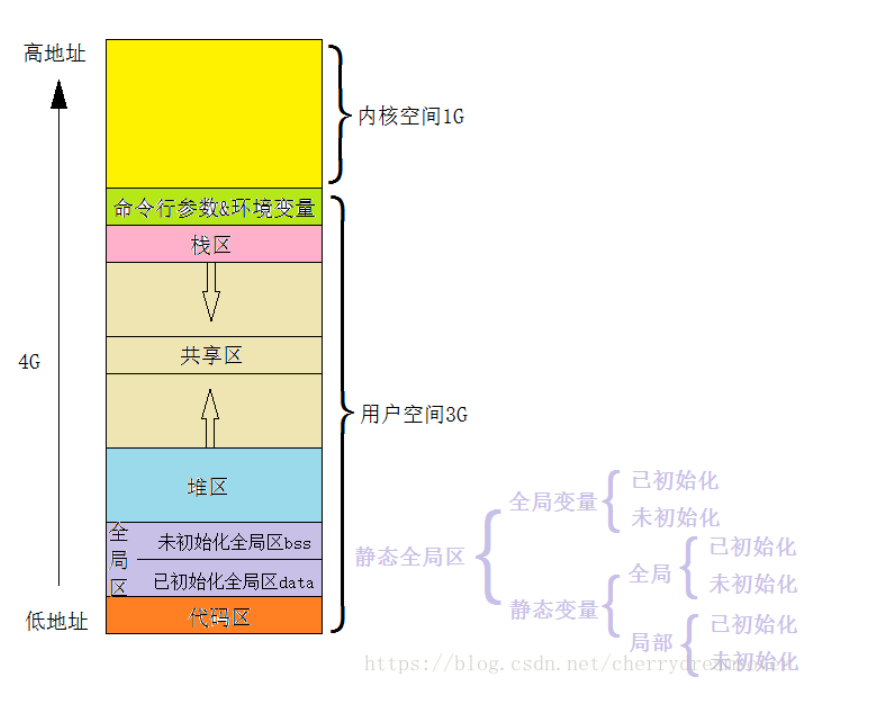

### 内存分配：

[brk mmap](https://blog.csdn.net/shuzishij/article/details/86574927)				

 					

 						 						 						 						 					

**在执行malloc申请内存的时候，操作系统是怎么做的?** 

从操作系统层面上看，malloc是通过两个系统调用来实现的: brk和mmap 

brk是将进程数据段(.data)的最高地址指针向高处移动，这一步可以扩大进程在运行时的堆大小 mmap是在进程的虚拟地址空间中寻找一块空闲的虚拟内存，这一步可以获得一块可以操作的堆内 存。 

通常，分配的内存小于128k时，使用brk调用来获得虚拟内存，大于128k时就使用mmap来获得虚拟内 存。 

进程先通过这两个系统调用获取或者扩大进程的虚拟内存，获得相应的虚拟地址，在访问这些虚拟地址 的时候，通过缺页中断，让内核分配相应的物理内存，这样内存分配才算完成。 

 			


**伙伴系统**

伙伴系统用于管理物理页，主要目的在于维护可用的连续物理空间，避免外部碎片。所有关于内存分配的操作都会与其打交道，buddy是物理内存的管理的门户。


**Slab**

slab的目的在于避免内部碎片。从buddy系统获取的内存至少是一个页，也就是4K，如果仅仅需要8字节的内存，显然巨大的内部碎片无法容忍。

slab从buddy系统申请空间，将较大的连续内存拆分成一系列较小的内存块。申请空间时从slab中获取大小最相近的小块内存，这样可以有效减少内部碎片。在slab最大的块为8K，slab中所有块在物理上也是连续的。

上面说的用于内存分配的slab是通用的slab，主要用于支持kmalloc分配内存。

slab还有一个作用就是用作对象池，针对经常分配和回收的对象比如task_struct，可以分配一个slab对象池对其优化。这种slab是独立于通用的内存分配slab的，在内核中有很多这样的针对特定对象的slab。


在内核中想要分配一段连续的内存，首先向slab系统申请，如果不满足（超过两个页面，也就是8K），直接向buddy系统申请。如果还不满足（超过4M，也就是1024个页面），将无法获取到连续的物理地址。可以通过vmalloc获取虚拟地址空间连续，但物理地址不连续的更大的内存空间。

**malloc**

malloc是用户态使用的内存分配接口，一般通过mmap实现。但是最终还是向buddy申请内存，因为buddy系统是管理物理内存的门户。申请到大块内存后，再像slab一样对其进行细分维护，根据用户需要返回相应内存的指针。


### 内存对齐

1. 第一个数据成员放在offset为0的地方，以后每个数据成员的对齐都要按照#pragma pack(n)指定的数值和这个结构体中的最大数据长度，比较小的进行。
2. 在数据成员对齐后，类或结构体自己本身也要进行对齐。

\#pragma pack(n)作为一个预编译指令用来设置多少个字节对齐的。n的缺省数值是按照编译器自身设置，一般为8，合法的数值分别是1、2、4、8、16。


### 介绍一下C++的多态

c++多态是继封装、继承之后面向对象的第三个特性。主要是为了接口重用。也就是不论传递过来的究竟是哪个类的对象，函数都可以通过同一个接口调用到适合各自对象的实现方法。


多态又分为静多态和动多态，主要根据函数调用是在什么是时间确定的。静多态是指在编译期就可以确定函数的调用地址，主要通过函数重载和泛型函数来实现。而动多态是在函数运行的时间确定调用哪个函数，由虚函数的来实现。

虚函数是在类成员函数前加上virtual关键字，在继承的子类中重写该函数。在使用的时候让基类指针或引用指向子类对象，再调用该函数的会调用子类的实现的函数。


### [C++强制类型转换](https://www.cnblogs.com/songhe364826110/p/11521589.html)

- **reinterpret_cast：将一个类型转换成另一个不同的类型**

用于指针类型之间、整数和指针类型之间的转换

- **const_cast：**用于去除变量的只读属性，强制转换的目标类型必须是指针或引用
- **static_cast：**用于基本类型之间、有继承关系的类对象之间、类指针之间转换，不能用于基本类型指针之间的转换，不是安全的；（类不是是多态类型的）

- **dynamic_cast:** 用于具有继承关系的类指针之间、有交叉关系的类指针之间的转换，具有类型检查的功能；（类中必须有虚函数，具有多态类型）；

```
总结:
去const属性用const_cast
基本类型转换用static_cast
多态类之间的类型转换用dynamic_cast
不同类型的指针类型转换用reinterpret_cast

// const_cast的使用
// 去掉类型的const或volatile属性
const int a = 10;
const int *f = &a;
int *d = const_cast<int*>(f);
*d = 3;
cout<<a;   // 10
cout<<*d;  // 3

// static_cast的使用
//1. 基本类型之间的转换
//2. 基类与子类的转换，但基类转子类是不安全的
//3. 任何类型的表达式转换为void
int n = 1;
double d = static_cast<double>(n);
int *pn = &n;
double *d = static_cast<double*>(pn);
void *p = static_cast<double*>(pn);

// dynamic_cast：有条件转换，动态类型转换，运行时检查类型安全，要求基类必须是虚函数
//1. 安全的基类和子类之间的转换
//2. 相同基类不同子类之间的交叉转换，但结果返回NULL
Father* fa = new Son();
Father* fa1 = new Father();

Son* s1 = dynamic_cast<Son*>(fa);  //向下类型转换，fa指向子类对象，没有问题
Son* s2 = dynamic_cast<Son*>(fa1); //向下类型转换，fa指向父类，没有子类的虚函数表等，转换失败返回null

Son *s3 = new Son();
Father* ff = dynamic_cast<Father*>(s3); //没有必要，直接ff = s3即可。
```


### 智能指针


### [C++内存管理](https://www.cnblogs.com/learning-zjx/p/10645659.html)

在c++中，内存地址由低到高分为代码段、数据段（存放已初始化的全局或静态变量）、BSS（存放未初始化的全局或静态变量）、堆、栈



另一种说法为栈、堆、自由存储区、全局/静态存储区、常量存储区

栈，在执行函数时，函数内局部变量的存储单元都可以在栈上创建，函数执行结束是这些存储单元自动被释放。栈内存分配运算内置于处理器的指令集中，效率高，分配的内存容量有限。

堆，就是那些由malloc等分配的内存块，用free来释放内存。

自由存储区，那些由new分配的内存块，由应用程序去控制，一般一个new就要对应一个delete。如果程序员没有释放掉，那么在程序结束后，操作系统会自动回收。

全局/静态存储区，全局变量和静态变量被分配到同一块内存中，在以前的C语言中，全局变量又分为初始化的和未初始化的，在C++里面没有这个区分了，他们共同占用同一块内存区。

常量存储区，这是一块比较特殊的存储区，他们里面存放的是常量，不允许修改。

**堆和自由存储区的区别**

堆是C语言和操作系统的术语、是操作系统维护的一块内存，而自由存储是C++中通过new与delete动态分配和释放对象的抽象概念。堆与自由存储区并不等价。

new所申请的内存区域在C++中称为自由存储区。是由堆实现的自由存储，可以说new所申请的内存区域在堆上。

**new delete**

```
1. 回调函数
bool func(int a, int b){
	return a > b;
}

vector<int> arr={3,2,4,5,6,5,9,10};
sort(arr.begin(), arr.end(), func);

2. 仿函数:仿函数不是一个函数，而是由类或结构体重载()操作符而实现的类似函数的行为，就是一个仿函数类。
struct cmp{
	bool operator()(const int a, const int b){
    	return a>b;
    }
};

sort(arr.begin(), arr.end(), cmp());

3. lambda表达式：
[capture list] (params list) mutable exception-> return type { function body }
主要由捕捉列表、形参列表、表明是否可以修改捕获的变量、返回类型、函数体；表达式的格式不是固定不变的
=表示以值的形式捕捉外部变量
&表示以引用形式捕捉外部变量

sort(arr.begin(), arr.end(), [](int a, int b){
	return a > b;
});
```


### 回调函数、仿函数、lambda函数

在c++的许多算法中，最后一个参数都是需要传入一个函数指针，当对数组或容器数据遍历时，通过函数指针指向的函数内部的逻辑处理进行过滤。第三个参数的实现形式，从最开始的普通的函数，到仿函数，最后到Lambda表达式。

```
1. 回调函数
bool func(int a, int b){
	return a > b;
}

vector<int> arr={3,2,4,5,6,5,9,10};
sort(arr.begin(), arr.end(), func);

2. 仿函数:仿函数不是一个函数，而是由类或结构体重载()操作符而实现的类似函数的行为，就是一个仿函数类。
struct cmp{
	bool operator()(const int a, const int b){
    	return a>b;
    }
};

sort(arr.begin(), arr.end(), cmp());

3. lambda表达式：
[capture list] (params list) mutable exception-> return type { function body }
主要由捕捉列表、形参列表、表明是否可以修改捕获的变量、返回类型、函数体；表达式的格式不是固定不变的
=表示以值的形式捕捉外部变量
&表示以引用形式捕捉外部变量

sort(arr.begin(), arr.end(), [](int a, int b){
	return a > b;
});
```


### strcpy、memcpy

strcpy用于字符串的拷贝，而memcpy可以用于任意数据的拷贝

strcpy拷贝时遇到'\0'停止，而memcpy指定拷贝的字节数，要考虑是否覆盖的问题

```
char* strcpy1(char* dst, const char* source){
    char *res;
    if(dst==nullptr && source==nullptr) return nullptr;

    while ((*dst++=*source++)!='\0');
    
    return dst;
}

void* mymemcpy(void *dst, const void *src, int n){
    if(dst==nullptr || src==nullptr || n<=0) return nullptr;

    char *pdst = (char*)dst;
    char *psrc = (char*)src;

    if(pdst>psrc && pdst<psrc+n){
        pdst = pdst + n - 1;
        psrc = psrc + n - 1;
        while(n--){
            *pdst-- = *psrc--;
        }
    }else{
        while (n--){
            *psrc++ = *pdst++;
        }
    }
    return dst;
}
```


### Linux调度算法：

Linux 标准内核实现两个调度类：采用 CFS 调度算法的默认调度类和实时调度类。

Linux 系统的调度基于调度类。每个类都有一个特定优先级。内核针对不同的调度类，采用不同的调度算法，以便满足系统与进程的需要。

完全公平调度CFS（Linux默认的调度算法）：CFS 调度并不采用严格规则来为一个优先级分配某个长度的时间片，而是为每个任务分配一定比例的 CPU 处理时间。每个任务分配的具体比例是根据友好值来计算的。友好值的范围从 -20 到 +19，数值较低的友好值表示较高的相对优先级。友好值越低，会得到更高比例的处理器处理时间。默认友好值为 0。任何进程所获得的处理器时间是由它自己和其他所有可运行进程nice值的相对差值决定的。nice值对应的时间不是一个绝对值，而是处理器的使用比。

实时调度：采用实时调度的任务比普通任务具有更高的优先级。Linux采用两个独立的优先级范围，一个用于实时任务，一个用于正常任务。实时任务分配静态优先级0-99，而正常任务分配的优先级为100-139，对应CFS的-20-19.


### const和constexpr

const 语义是**只读**，所以可以在运行时进行初始化。

constexpr 语义是**常量**，所以编译时就要进行初始化。

#### string类

##### 1.1 string成员函数

#####   string构造函数和析构函数

构造函数有四个参数，其中三个具有默认值。要初始化一个 string 类，可以使用 C 风格字符串或 string 类型对象，也可以使用 C 风格字符串的部分或 string 类型对象的部分或序列。

常见的 string 类构造函数有以下几种形式：

```c++
string strs //生成空字符串
string s(str) //生成字符串str的复制品
string s(str, stridx) //将字符串str中始于stridx的部分作为构造函数的初值
string s(str, strbegin, strlen) //将字符串str中始于strbegin、长度为strlen的部分作为字符串初值
string s(cstr) //以C_string类型cstr作为字符串s的初值
string s(cstr,char_len)  //以C_string类型cstr的前char_len个字符串作为字符串s的初值
strings(num, c) //生成一个字符串，包含num个c字符
strings(strs, beg, end)  //以区间[beg, end]内的字符作为字符串s的初值
```

析构函数的形式如下：
如果字符串只包含一个字符，使用构造函数对其初始化时，使用以下两种形式比较合理：

```c++
std::string s('x');  //错误
std::string s(1, 'x');  //正确
```

或

```c++
std::string s("x");  //正确
```


通常，程序员在整个程序中应坚持使用 string 类对象，直到必须将内容转化为 char* 时才将其转换为 C_string。

```c++
#include <iostream>
#include <string>
using namespace std;

int main ()
{
    string str ("12345678");
    char ch[ ] = "abcdefgh";
    string a; //定义一个空字符串
    string str_1 (str); //构造函数，全部复制
    string str_2 (str, 2, 5); //构造函数，从字符串str的第2个元素开始，复制5个元素，赋值给str_2
    string str_3 (ch, 5); //将字符串ch的前5个元素赋值给str_3
    string str_4 (5,'X'); //将 5 个 'X' 组成的字符串 "XXXXX" 赋值给 str_4
    string str_5 (str.begin(), str.end()); //复制字符串 str 的所有元素，并赋值给 str_5
    cout << str << endl;
    cout << a << endl ;
    cout << str_1 << endl;
    cout << str_2 << endl;
    cout << str_3 << endl;
    cout << str_4 << endl;
    cout << str_5 << endl;
    return 0;
}
```

##### C++获取字符串长度

String 类型对象包括三种求解字符串长度的函数：size()和length()、maxsize()和 capacity()

- size() 和 length()：这两个函数会返回 string 类型对象中的字符个数，且它们的执行效果相同。
- max_size()：max_size() 函数返回 string 类型对象最多包含的字符数。一旦程序使用长度超过 max_size() 的 string 操作，编译器会拋出 length_error 异常。
- capacity()：该函数返回在重新分配内存之前，string 类型对象所能包含的最大字符数。


string 类型对象还包括一个 reserve() 函数。调用该函数可以为 string 类型对象重新分配内存。重新分配的大小由其参数决定。reserve() 的默认参数为 0。


##### C++ string获取字符串元素：[]和at()

字符串中元素的访问是允许的，一般可使用两种方法访问字符串中的单一字符：下标操作符[] 成员函数at()两者均返回指定的下标位置的字符。第 1 个字符索引（下标）为 0，最后的字符索引为 length()-1。

需要注意的是，这两种访问方法是有区别的：

- 下标操作符 [] 在使用时不检查索引的有效性，如果下标超出字符的长度范围，会示导致未定义行为。对于常量字符串，使用下标操作符时，字符串的最后字符（即 '\0'）是有效的。对应 string 类型对象（常量型）最后一个字符的下标是有效的，调用返回字符 '\0'。
- 函数 at() 在使用时会检查下标是否有效。如果给定的下标超出字符的长度范围，系统会抛出 out_of_range 异常。


##### C++ string字符串比较方法详解

 Basic_string 类模板既提供了 >、<、==、>=、<=、!= 等比较运算符，还提供了 compare() 函数，其中 compare() 函数支持多参数处理，支持用索引值和长度定位子串进行比较。该函数返回一个整数来表示比较结果。如果相比较的两个子串相同，compare() 函数返回 0，否则返回非零值。 

###### compare()函数

类 basic_string 的成员函数 compare() 的原型如下：

```c++
 int compare (const basic_string& s) const;
int compare (const Ch* p) const;
int compare (size_type pos, size_type n, const basic_string& s) const;
int compare (size_type pos, size_type n, const basic_string& s,size_type pos2, size_type n2) const;
int compare (size_type pos, size_type n, const Ch* p, size_type = npos) const; 
```

如果在使用 compare() 函数时，参数中出现了位置和大小，比较时只能用指定的子串。例如：

```c++
s.compare {pos,n, s2);
```

若参与比较的两个串值相同，则函数返回 0；若字符串 S 按字典顺序要先于 S2，则返回负值；反之，则返回正值。下面举例说明如何使用 string 类的 compare() 函数。

##### string字符串修改和替换方法

 可以通过使用多个函数修改字符串的值。例如 assign()，operator=，erase()，交换（swap），插入（insert）等。另外，还可通过 append() 函数添加字符。 

1. ```c++
   string str1 ("123456");
   string str;
   str.assign (str1); //直接赋值
   str.assign (str1, 3, 3); //赋值给子串
   str.assign (str1,2,str1.npos);//赋值给从位置 2 至末尾的子串
   str.assign (5,'X'); //重复 5 个'X'字符
   ```

erase() 函数的原型为：
erase() 函数的使用方法为：

 iterator erase (iterator first, iterator last);
iterator erase (iterator it);
basic_string& erase (size_type p0 = 0, size_type n = npos); 

str.erase (str* begin(), str.end());
或 str.erase (3);