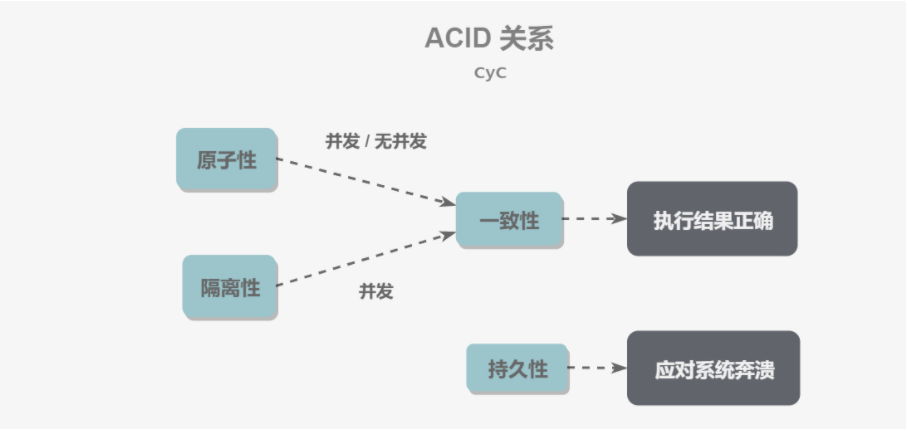

### 索引的优点

- 大大减少了服务器需要扫描的数据行数
- 帮助服务器避免进行排序和分组，以及避免创建临时表

- 将随机I/O变为顺序I/O（B+Tree索引是有序的，会将相邻的数据都存储在一起）

### 索引的缺点

- 创建索引和维护索引要耗费时间，这种时间随着数据量的增加而增加
- 索引需要占用物理空间，除了数据表占数据空间外，每一个索引还要占用一定的物体空间，如果要建立聚簇索引，那么需要的空间就会更大

- 对表中的数据进行增加、删除、修改的时候，索引也要动态的维护，这样降低了数据的维护速度

### 事务

指满足ACID特性的一组操作，可以通过commit提交一个事务，也可以使用rollback进行回滚

#### ACID

- 原子性：事务的所有操作要么成功要么失败。
- 一致性：在事务执行前后保持一致性。

- 隔离性：一个事务所做的修改在最终提交以前，对其他事务是不可见的
- 持久性：一旦事务提交，所作的修改将永久保存到数据库中。

### 并发一致性

- 丢失修改：一个事务的更新操作被另一个事务的更新操作替换
- 读脏数据：在不同的事务下，当前事务可以读取到其他事务未提交的数据。

- 不可重复读：一个事务多次读取同一数据集合。在这一事务未结束之前，另一个事务也访问了该同一数据并做了修改，由于第二个事务的修改，第一个事务两次读取的数据可能不一样。
- 幻影读：不可重复读的一种，一个事务读取某个范围内的数据，另一个事务插入了一条数据，当再次读取这个范围内的数据，两次结果会不同。

### 封锁

#### 封锁力度

提供了两种封锁力度：行级锁和表级锁

应该尽量只锁定需要修改的那部分数据，而不是所有的资源，锁定的数据量越少，发生锁争用的可能就越小，系统的并发程度就越高。但是加锁需要消耗资源，锁的各种操作（包括获取锁、释放锁、以及检查锁状态）都会增加系统开销。因此封锁粒度越小，系统开销就越大。

在选择封锁粒度时，需要在锁开销和并发程度之间做一个权衡。

#### 封锁类型

- 读写锁

- 互斥锁：又称写锁
- 共享锁：又称读锁

规定加了写锁后，可以对数据进行读取和更新，其他事务不能加锁

加了读锁后，可以读取。其他事务可以加读锁，不能加写锁。

#### 封锁协议

- 三级封锁协议

- 一级封锁协议：事务T向修改数据时必须加写锁，直到结束后释放。（**解决丢失修改**的问题）
- 二级封锁协议：在一级的基础上，读数据时必须加读锁，读取完后释放锁。（**解决读脏数据**的问题）

- 三级封锁协议：在二级的基础上，读数据必须加读锁，事务结束后才释放锁（**解决不可重复读**的问题）

- 两段锁协议

加锁和解锁分为两个阶段进行

#### 隔离级别

- 未提交读：事务中修改，没有提交对其他事务也可见
- 提交读：只有事务提交后，数据才可以被其他事务可见

- 可重复读：保证同一个事务中多次读取同一数据的结果是一样的
- 可串行化：强制事务串行化，使得多个事务互不干扰，不会出现并发一致性问题。

### innode索引：B+ Tree原理

- 数据结构

B Tree 指的是 Balance Tree，也就是平衡树。平衡树是一颗查找树，并且所有叶子节点位于同一层。

B+ Tree 是基于 B Tree 和叶子节点顺序访问指针进行实现，它具有 B Tree 的平衡性，并且通过顺序访问指针来提高区间查询的性能。

在 B+ Tree 中，一个节点中的 key 从左到右非递减排列，如果某个指针的左右相邻 key 分别是 keyi 和 keyi+1，且不为 null，则该指针指向节点的所有 key 大于等于 keyi 且小于等于 keyi+1。

- 操作

进行查找操作时，首先在根节点进行二分查找，找到一个 key 所在的指针，然后递归地在指针所指向的节点进行查找。直到查找到叶子节点，然后在叶子节点上进行二分查找，找出 key 所对应的 data。

插入删除操作会破坏平衡树的平衡性，因此在进行插入删除操作之后，需要对树进行分裂、合并、旋转等操作来维护平衡性。

-  与红黑树的比较

红黑树等平衡树也可以用来实现索引，但是文件系统及数据库系统普遍采用 B+ Tree 作为索引结构，这是因为使用 B+ 树访问磁盘数据有更高的性能。

（一）B+ 树有更低的树高

平衡树的树高 O(h)=O(logdN)，其中 d 为每个节点的出度。红黑树的出度为 2，而 B+ Tree 的出度一般都非常大，所以红黑树的树高 h 很明显比 B+ Tree 大非常多。

（二）磁盘访问原理

操作系统一般将内存和磁盘分割成固定大小的块，每一块称为一页，内存与磁盘以页为单位交换数据。数据库系统将索引的一个节点的大小设置为页的大小，使得一次 I/O 就能完全载入一个节点。

如果数据不在同一个磁盘块上，那么通常需要移动制动手臂进行寻道，而制动手臂因为其物理结构导致了移动效率低下，从而增加磁盘数据读取时间。B+ 树相对于红黑树有更低的树高，进行寻道的次数与树高成正比，在同一个磁盘块上进行访问只需要很短的磁盘旋转时间，所以 B+ 树更适合磁盘数据的读取。

（三）磁盘预读特性

为了减少磁盘 I/O 操作，磁盘往往不是严格按需读取，而是每次都会预读。预读过程中，磁盘进行顺序读取，顺序读取不需要进行磁盘寻道，并且只需要很短的磁盘旋转时间，速度会非常快。并且可以利用预读特性，相邻的节点也能够被预先载入。

### MySQL 索引

索引是在存储引擎实现的，而不是再服务器层实现的，不同的引擎具有不同的索引

- B+ Tree索引

大多数mysql默认的索引，不需要全表扫描，只需要对树进行扫描，可以用于查找排序和分组

- 哈希索引

以O(1)的时间进行查找，但是无序。无法用于排序和分组，只支持精确查找，无法用于部分和范围查找

- 全文索引

MyISAM存储引擎支持全文索引，使用倒排索引实现，用于查找文本中的关键词。InnoDB后面的版本也支持

- 空间数据索引

MyISAM存储引擎支持的空间数据索引，可以用于地理数据存储。

### 存储引擎

#### InnoDB

是 MySQL 默认的事务型存储引擎，只有在需要它不支持的特性时，才考虑使用其它存储引擎。

实现了四个标准的隔离级别，默认级别是可重复读（REPEATABLE READ）。在可重复读隔离级别下，通过多版本并发控制（MVCC）+ Next-Key Locking 防止幻影读。

主索引是聚簇索引，在索引中保存了数据，从而避免直接读取磁盘，因此对查询性能有很大的提升。

内部做了很多优化，包括从磁盘读取数据时采用的可预测性读、能够加快读操作并且自动创建的自适应哈希索引、能够加速插入操作的插入缓冲区等。

支持真正的在线热备份。其它存储引擎不支持在线热备份，要获取一致性视图需要停止对所有表的写入，而在读写混合场景中，停止写入可能也意味着停止读取。

#### MyISAM

设计简单，数据以紧密格式存储。对于只读数据，或者表比较小、可以容忍修复操作，则依然可以使用它。

提供了大量的特性，包括压缩表、空间数据索引等。

不支持事务。

不支持行级锁，只能对整张表加锁，读取时会对需要读到的所有表加共享锁，写入时则对表加排它锁。但在表有读取操作的同时，也可以往表中插入新的记录，这被称为并发插入（CONCURRENT INSERT）。

可以手工或者自动执行检查和修复操作，但是和事务恢复以及崩溃恢复不同，可能导致一些数据丢失，而且修复操作是非常慢的。

如果指定了 DELAY_KEY_WRITE 选项，在每次修改执行完成时，不会立即将修改的索引数据写入磁盘，而是会写到内存中的键缓冲区，只有在清理键缓冲区或者关闭表的时候才会将对应的索引块写入磁盘。这种方式可以极大的提升写入性能，但是在数据库或者主机崩溃时会造成索引损坏，需要执行修复操作

#### 比较

- 事务：InnoDB 是事务型的，可以使用 Commit 和 Rollback 语句。
- 并发：MyISAM 只支持表级锁，而 InnoDB 还支持行级锁。

- 外键：InnoDB 支持外键。
- 备份：InnoDB 支持在线热备份。

- 崩溃恢复：MyISAM 崩溃后发生损坏的概率比 InnoDB 高很多，而且恢复的速度也更慢。
- 其它特性：MyISAM 支持压缩表和空间数据索引。

### 多版本并发控制

多版本并发控制（MVCC），是InnoDB存储引擎实现隔离的一种具体方式，用于**实现提交读和可重复读这两种隔离**。未提交读隔离级别总是读取最新的数据行，要求低，无需使用MVCC。可串行化隔离级别需要对所有读取的行都加锁，单纯使用MVCC无法实现。

#### Undo日志

MVCC多版本指的是多个版本的快照，看快照存储在Undo日志中，该日志通过回滚指针把一个数据行的快照连接在一起

#### ReadView

mvcc维护一个ReadView结构，主要包含当前系统未提交的事务列表还有该列表的最大值MAX和最小值MIN

。在select操作时，根据数据行快照的值与max和min的关系，来判断数据行快照是否可用。

### Next-Key Locks

主要为了解决幻影读问题。在可重复读隔离级别下，使用MVCC+Next_Key Locks可以解决幻读问题。

Next-Key Locks是在存储引擎innodb、事务级别在可重复读的情况下使用的数据库锁，Next-Key Locks是行锁和gap锁的组合。innodb默认的锁就是Next-Key locks。

gap锁，又称为间隙锁。存在的主要目的就是为了防止在可重复读的事务级别下，出现幻读问题。

在可重复读的事务级别下面，普通的select读的是快照，不存在幻读情况，但是如果加上for update（当前读）的话，读取是已提交事务数据，gap锁保证for update情况下，不出现幻读。

### 范式

主要是为了建立冗余小、结构合理的数据库。

- 第一范式（确保每列的原子性）

最基本的范式，要求数据库中的所有列都是不可分解的原子值

- 第二范式（确保表中的每列都和主键相关）

确保数据库表中的每一列都要和主键相关，而不是和主键的某一部分相关（主要指联合主键）

- 第三范式（确保每列都是和主键列直接相关，而不是间接相关）

### 数据库的4种存储引擎

（1）MyISAM存储引擎：不支持事务、也不支持外键，优势是访问速度快，对事务完整性没有 要求或者以select，insert为主的应用基本上可以用这个引擎来创建表。

1）存储格式：静态表；动态表；压缩表

　　　a、静态表：表中的字段都是非变长字段，这样每个记录都是固定长度的，优点存储非常迅速，容易缓存，出现故障容易恢复；缺点是占用的空间通常比动态表多（因为存储时会按照列的宽度定义补足空格）ps：在取数据的时候，默认会把字段后面的空格去掉，如果不注意会把数据本身带的空格也会忽略。

　　　b、动态表：记录不是固定长度的，这样存储的优点是占用的空间相对较少；缺点：频繁的更新、删除数据容易产生碎片，需要定期执行OPTIMIZE TABLE或者myisamchk-r命令来改善性能

　　　c、压缩表：因为每个记录是被单独压缩的，所以只有非常小的访问开支。

（2）innoDB：该存储引擎提供了具有提交、回滚和崩溃恢复能力的事务安全。但是对比MyISAM引擎，写的处理效率会差一些，并且会占用更多的磁盘空间以保留数据和索引。

（3）Memory存储引擎：Memory存储引擎使用存在于内存中的内容来创建表。每个memory表只实际对应一个磁盘文件，memory类型的表访问非常的快，默认使用HASH索引，但是一旦服务关闭，表中的数据就会丢失掉。

（4）Merge存储引擎：Merge存储引擎是一组MyISAM表的组合，这些MyISAM表必须结构完全相同，merge表本身并没有数据，对merge类型的表可以进行查询，更新，删除操作，这些操作实际上是对内部的MyISAM表进行的

### 为什么用数据库连接池？

1）资源重用。连接池里的连接可以重复使用，避免了频繁创建、释放连接引起的大量性能开销。

2）更快的系统响应速度 。数据库连接池在初始化过程中，往往已经创建了若干数据库连接置于池中备用。此时连接的初始化工作均已完成。对于业务请求处理而言，直接利用现有可用连接，避免了数据库连接初始化和释放过程的时间开销，从而缩减了系统整体响应时间。

### 悲观锁和乐观锁

悲观锁:

当要对数据库中的一条数据进行修改的时候，为了避免同时被其他人修改，最好的办法就是直接对该数据进行加锁以防止并发。这种借助数据库锁机制，在修改数据之前先锁定，再修改的方式被称之为悲观并发控制

之所以叫做悲观锁，是因为这是一种对数据的修改持有悲观态度的并发控制方式。总是假设最坏的情况，每次读取数据的时候都默认其他线程会更改数据，因此需要进行加锁操作，当其他线程想要访问数据时，都需要阻塞挂起。悲观锁的实现：

1. 传统的关系型数据库使用这种锁机制，比如行锁，表锁等，读锁，写锁等，都是在做操作之前先上锁。
2. Java 里面的同步 synchronized 关键字的实现。

悲观锁主要分为共享锁和排他锁,又称读锁和写锁

乐观锁:
  乐观锁假设数据一般情况下不会造成冲突，所以在数据进行提交更新的时候，才会正式对数据的冲突与否进行检测，如果发现冲突了，则返回给用户错误的信息，让用户决定如何去做。乐观锁适用于读操作多的场景，这样可以提高程序的吞吐量。

### 为什么一条SQL语句执行得很慢？

主要分为两种情况

1.大多数情况是正常，偶尔很慢

- 当我们要往数据库插入或更新一条数据的时候，数据库会在内存中把对应字段的数据更新了，但是更新之后，这些更新的字段并不会马上同步持久化到磁盘中去，而是把这些更新的记录写入到 redo log 日志中去，等到空闲的时候，在通过 redo log 里的日记把最新的数据同步到磁盘中去。不过，redo log 里的容量是有限的，如果数据库一直很忙，更新又很频繁，这个时候 redo log 很 快就会被写满了，这个时候就没办法等到空闲的时候再把数据同步到磁盘的，只能暂停其他操作把数据同步到磁盘中去的，而这个时候，就会导致我们平时正常的SQL语句突然执行的很慢，所以说，数据库在在同步数据到磁盘的时候，就有可能导致我们的SQL语句执行的很慢了。
- 执行时遇到表锁行锁，别人操作数据库用到表或者行数据加锁了，只能慢慢等待别人释放锁

2.这条SQL语句一直很慢

- 没有用索引，例如该字段没有用上索引
- 由于对字段运算，函数操作没有用上索引

- 数据库采样预测索引基础失误，导致系统没有走索引，而是走了全表扫描